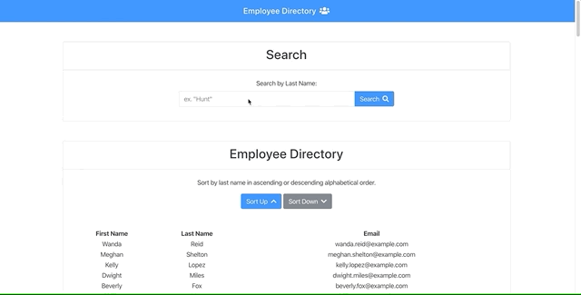

# Employee Directory

A React application that is built with stateful components, which allows a user to view and sort within an employee directory table.

## Screenshot of Application

## Live Link
Launch the application [here](---)

## Technologies Used
- HTML5
- CSS3 (Sass/Bootstrap)
- JavaScript
- React

## Features
- Search employees by last name
- Sort employee directory by last name in:
    - ascending order
    - descending order

## Business Context
An employee or manager would benefit greatly from being able to view non-sensitive data about other employees. It would be particularly helpful to be able to filter employees by name.

## User Story
- AS AN employer
- I WANT to be able to view, search and filter my employee directory
- SO THAT my employees information is easily accessible and manageable

## Acceptance Criteria
- GIVEN a table of random users
- WHEN the user loads the page
- THEN a table of employees should render with the ability to search and sort by last name

- - -
© 2020 [Madeline Jimenez](https://github.com/mijimenez)